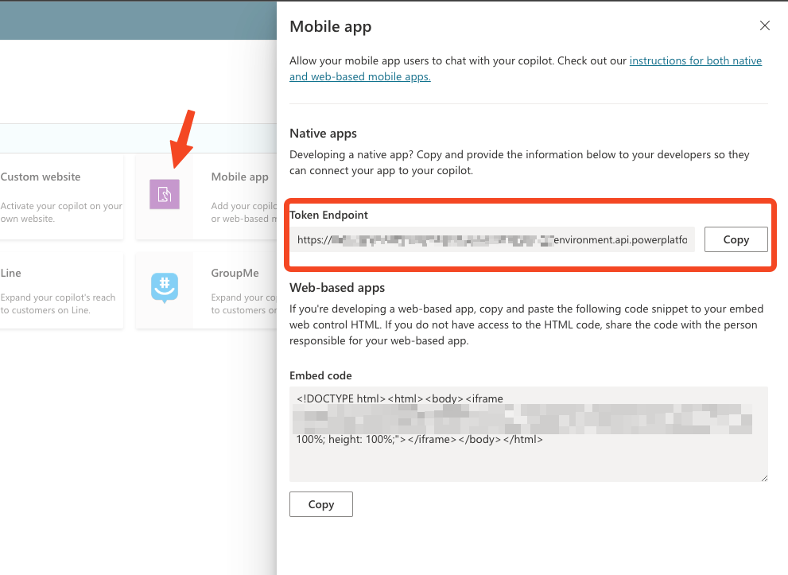
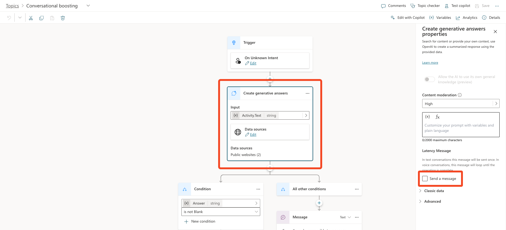

# Integrate Azure AI Speech with Copilot Studio Bot
This is a sample code to integrate Azure AI Speech with Copilot Studio Bot.

## Components
- [Microsoft Copilot Studio](https://www.microsoft.com/en-us/microsoft-copilot/microsoft-copilot-studio)
- [Azure AI Speech](https://learn.microsoft.com/en-us/azure/ai-services/speech-service/)

## Steps
1. Create a custom canvas in Copilot Studio
2. Create Cognitive Services Speech Service
3. Create custom canvas and embed bot with direct line endpoint token

4. Get token from Cognitive Services Speech
5. Update the token and endpoint in HTML
6. Disable auto send GPT message in copilot

   
## Reference
- [Options to include speech in Copilot Studio Bot](https://github.com/microsoft/CopilotStudioSamples/tree/master/RelayBotSample)
- [Custom Canvas for Microsoft Copilot Studio](https://learn.microsoft.com/en-us/microsoft-copilot-studio/customize-default-canvas?tabs=web)
- [Azure AI Speech for Bot Framework](https://github.com/microsoft/BotFramework-WebChat/tree/main/samples/03.speech/b.cognitive-speech-services-js)
