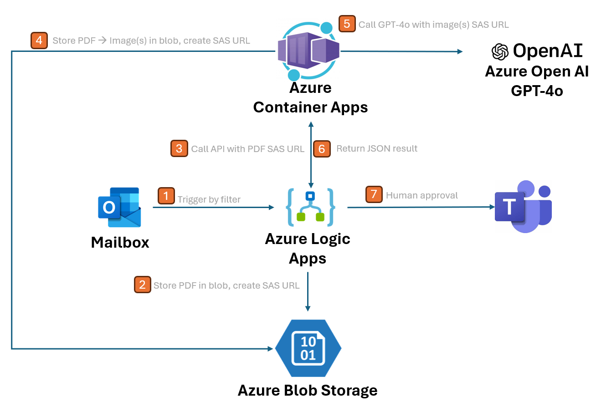
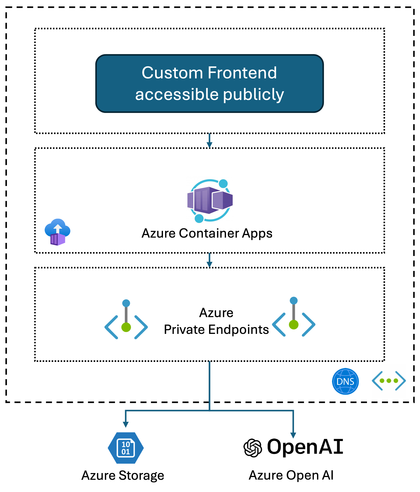

# Form Extraction Approval
This is a demo project to show how to leverage GPT4 model to extract information from forms and trigger approval workflows.

The demo is build using [Azure Logic Apps](https://learn.microsoft.com/en-us/azure/logic-apps/logic-apps-overview) and [Azure Container Apps](https://learn.microsoft.com/en-us/azure/container-apps/overview).

Azure Logic Apps is being used as a trigger to extract attachements (in this case, PDF), upload the PDF to Azure Blob Storage, and call the Azure Container Apps to extract the information from the PDF. The Azure Container Apps runs the API that convert PDF to images, and call Azure Open AI GPT4 model to extract the information.

## Architecture


Integration to Microsoft Outlook and Microsoft Teams are optional, it was selected for demostration purposes. The highlight for this sample is to show how Azure Open AI GPT4o can be used to extract content from forms.

## Test the API locally
The API is built using Flask, written in Python. Provide the following environment variables.

| Environment Variable | Remarks |
| -------- | -------- |
| AZURE_STORAGE_CONNECTION_STRING  | Connection string for Azure Storage to store images  |
| AZURE_STORAGE_ACCOUNT_NAME | Azure storage account name |
| AZURE_CONTAINER_NAME  | Azure Storage Container name to store images  |
|GPT4_ENDPOINT | Azure Open AI GPT4o model endpoint, including the model deployment name. Example: https://azureopenaidemo.openai.azure.com/openai/deployments/gpt4o/chat/completions?api-version=2024-02-15-preview|
|GPT4_KEY | Azure Open AI GPT4o API key|
|SYSTEM_PROMPT| System prompt to be used by GPT4o model. Sample:"You are an AI assistant that extract information from medical certificate. You only response as JSON." |
|USER_PROMPT| User prompt to be used by GPT4o model. Sample: "extract patient name, NRIC, hospital name, leave date and duration. for NRIC, only keep the last 4 characters. reply in JSON. Sample response: {\"name\": \"name\", \"NRIC\": \"123D\", \"hospital\": \"hospital\", \"duration_day\": 3, \"from_date\": \"2024-01-01\", \"to_date\": \"2024-01-02\"}."|

Run the following command to start the API
```bash
python3 main.py
```

The API will be available at http://localhost:5000. Test the API as follow:
```bash
curl --request POST --url http://localhost:5000/convert-pdf --header 'content-type: application/json' --data '{"pdf_url":"https://test.blob.core.windows.net/medicalcertificate/mc.pdf"}'
```

## Deploy to Azure Container Apps
Create an [Azure Container Registry](https://learn.microsoft.com/en-us/azure/container-registry/), or any container registry of your choice. Build the container image and push to the container registry.

Command to build this container image and push to Azure Container Registry. Replace container registry name, image name and tag accordingly.
```bash
docker build -t <container-registry-name>.azurecr.io/<image-name>:<tag> .
docker push <container-registry-name>.azurecr.io/<image-name>:<tag>
```

## Sample flow using Azure Logic Apps
<video width="320" height="240" controls>
  <source src="./assets/logic app.mp4" type="video/mp4">
  Your browser does not support the video tag.
</video>

## Security consideration
It is possible to harden the deployment, to ensure secured data transfer between client and various Azure services. Notably, some considerations are listed below.

### 1. Azure Container Apps
Azure Container Apps is deployed inside Container Apps Environment, which is managed by Microsoft. To gain full control on the network, developer can deploy Azure Container Apps in custom VNET, where Container App Environment is hosted in a dedicated subnet within this VNET.

There's an option to make the Azure Container Apps private, only accessible privately. Azure Private DNS Zone can be used to enable private DNS resolution for the Azure Container Apps, having the A record pointing to the FQDN or Azure Container App Environment Load Balancer.

### 2. Azure Storage
Azure Storage can be secured using Azure Private Endpoint, where the storage account is only accessible privately. In this case, the container hosted in Azure Container Apps can access this storage account privately without public endpoint.

### 3. Azure Open AI
Azure Open AI services support private endpoint as well. Likewise, the container can consume the Azure Open AI services privately. 

In this use case, we are sending the image content over. The first API append image URL in the request body, and the image is stored in Azure Storage. The access is granted using shared access signature. However, when the storage account is secured using Azure Private Endpoint, the image URL will not be accessible publicly, and hence Azure Open AI will not be able to retrieve the image content. The alternatives would be sending the image content directly to Azure Open AI, with optional settings to store images in Azure Storage for audit purposes.

### Architecture (Variation with private endpoints and custom Frontend UI)

